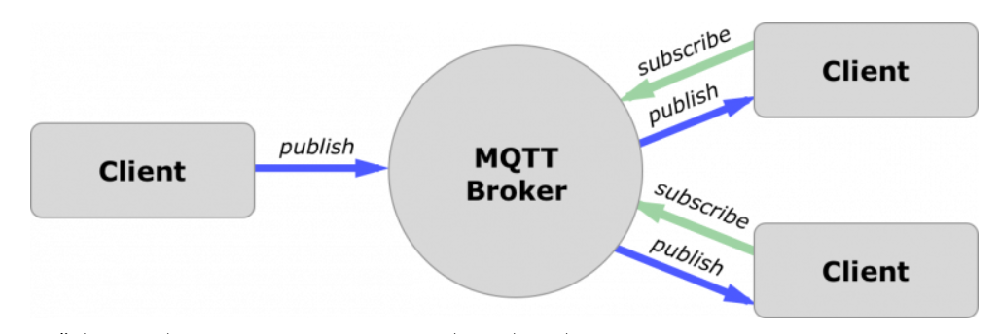
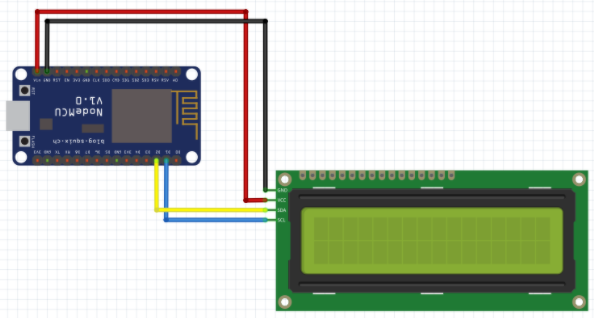
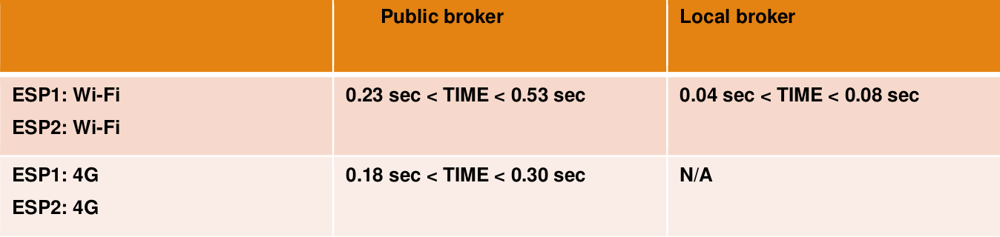
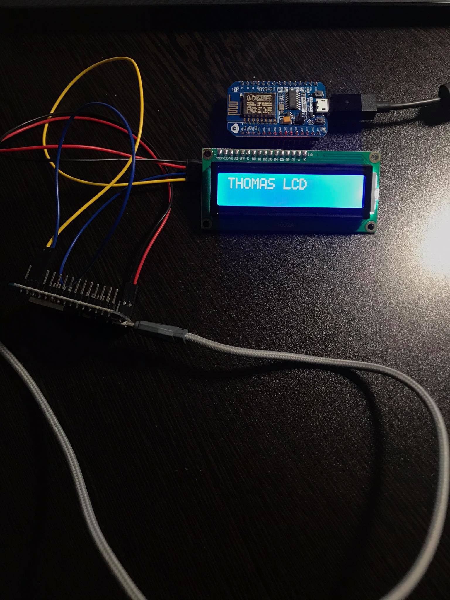

# Communication via MQTT

<ins>Στόχος:</ins>

I. Επικοινωνία μέσω του MQTT protocol, με Wi-Fi και 4G

II. Αποστολή μηνυμάτων κατόπιν αιτήματος

III. Αποστολή περιοδικών μηνυμάτων χωρίς αίτημα

IV. Σύγκριση επικοινωνίας τοπικού broker και public broker

****

<ins> Η επικοινωνία μέσω MQTT περιλαμβάνει: Broker και Clients.</ins>
1) Δημιουργία ενός τοπικού MQTT broker (Localhost) ο οποίος θα είναι ανοιχτός για την σύνδεση των
clients σε κάποιο συγκεκριμένο Port (πχ. 80) και εγκατάσταση.
2) Δημιουργία ενός public broker, δηλαδή ενός Server στο Internet που υποστηρίζει επίσης την
επικοινωνία αυτή.
3) Δημιουργία των client και προγραμματισμός των Arduino για την επικοινωνία.

****

<ins>Παρακάτω η συνδεσμολογία. Η συγκεκριμένη LCD 16x2
έχει ενσωματωμένο το dimmer και καθιστά την σύνδεση του απλούστερη.</ins>
1) 5V (Red) – Παροχή 5V.
2) GND (Black) – Γείωση.
3) SCL (Serial Clock)(Blue) – Η γραμμή ρολογιού
4) SDA (Serial Data)(Yellow) – Η γραμμή δεδομένων.

****
<ins>Παρακάτω φαίνεται ο πίνακας χρόνων μίας ping-pong ανταλλαγής μηνυμάτων.
  

 -Ανάμεσα στην σύνδεση Wi-Fi και 4G σε public broker βλέπουμε πως το 4G είναι πιο γρήγορο.

-Ανάμεσα σε τοπικό και public broker βλέπουμε μια τεράστια διαφορά για τόσο μικρό όγκο δεδομένων

-Γενικά: Public-Wi-Fi > Public-4G > Local-Wi-fi

-Στον local broker με σύνδεση 4G είναι N/A καθώς δεν μπορεί να localhost broker με σύνδεση στα data

****

# Final connection

****
