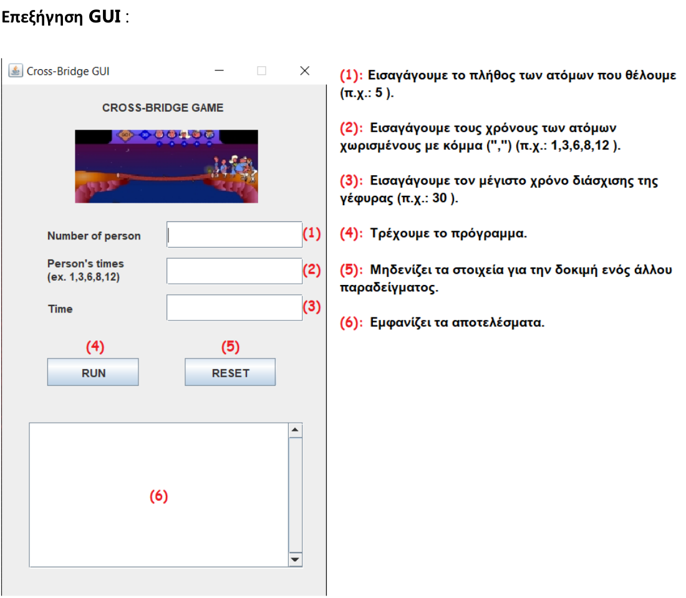
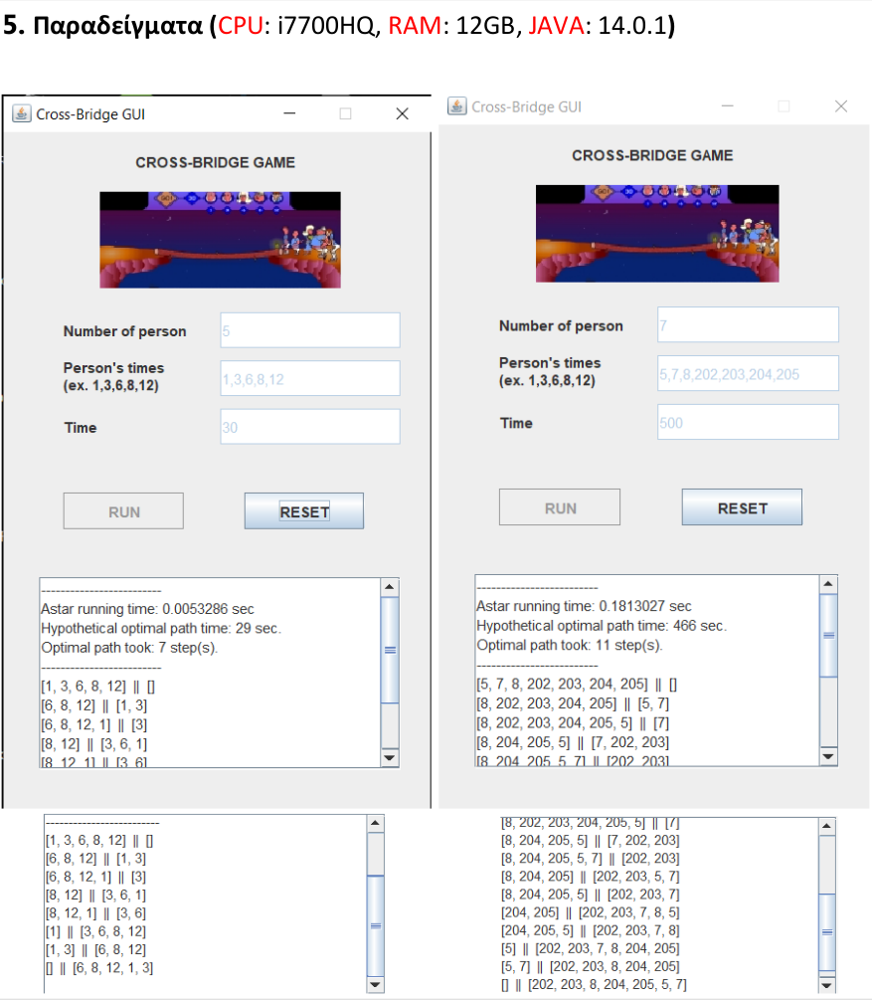

# Cross-Bridge Game

#  Δυνατότητες του προγράμματος
• Υπολογίζει το βέλτιστο μονοπάτι που πρέπει να ακολουθήσει, δηλαδή το ελάχιστο κόστος για
τη διάσχιση της γέφυρας από τα άτομα, στα πλαίσια του δοσμένου χρόνου.
• Αναγνωρίζει αν το input είναι λανθασμένο και ενημερώνει κατάλληλα.
• Εάν, βάση του δοσμένου χρόνου δεν υπάρχει βέλτιστο μονοπάτι ενημερώνει αντίστοιχα.
• Ακόμη και για άτομα με ίδιους χρόνους το πρόγραμμα, μπορεί και βρίσκει το βέλτιστο
μονοπάτι.

# Μέθοδοι AI που χρησιμοποιήθηκαν
Χρησιμοποιείται ο αλγόριθμος αναζήτησης Α* με μια heuristic συνάρτηση (int heuristic ()), η οποία
βρίσκεται στην State.java. Ουσιαστικά η Α* αναζητά στην ταξινομημένη λίστα την επόμενη
κατάσταση και για όσο υπάρχουν paths to explore. Αν ο χρόνος τελειώσει τότε σταματά την
αναζήτηση. Σε κάθε άλλη περίπτωση είναι ένα βήμα πιο κοντά στο να χτίσει το μονοπάτι.

****
